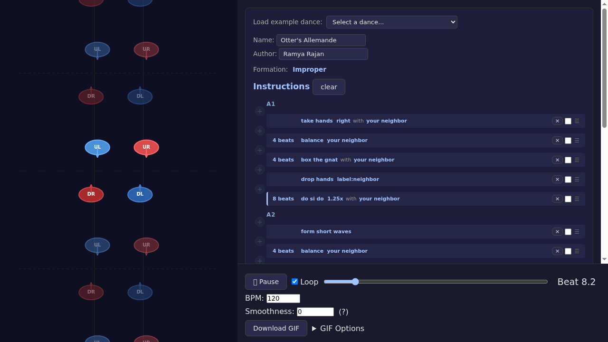
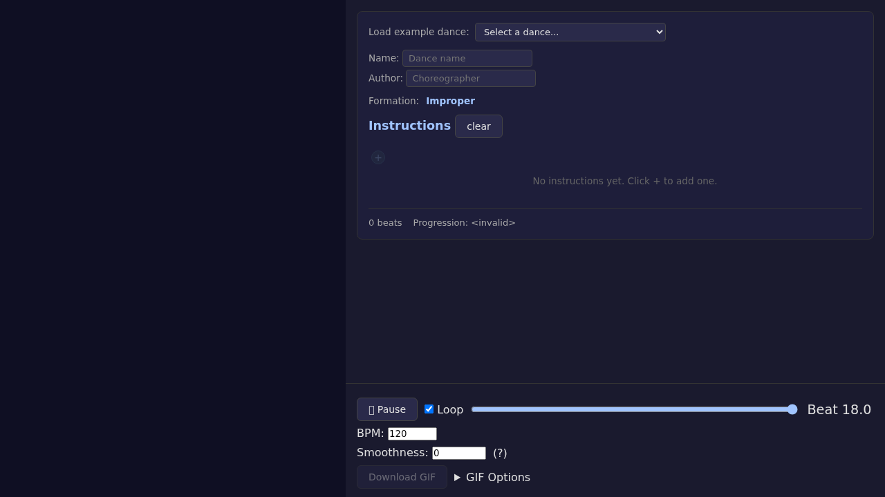
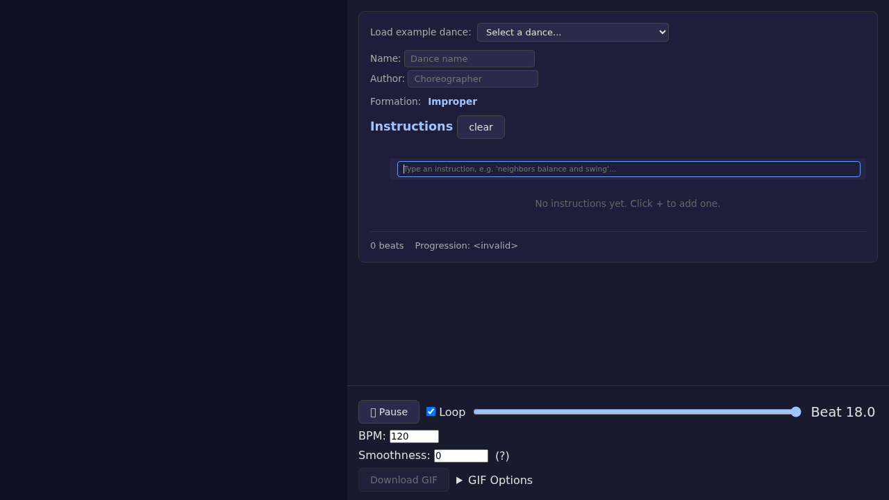
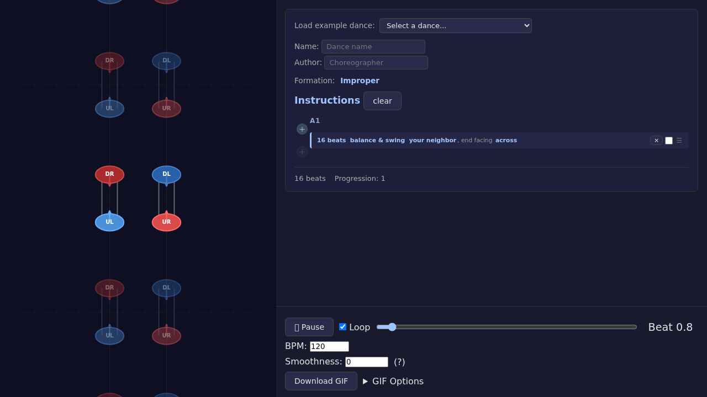
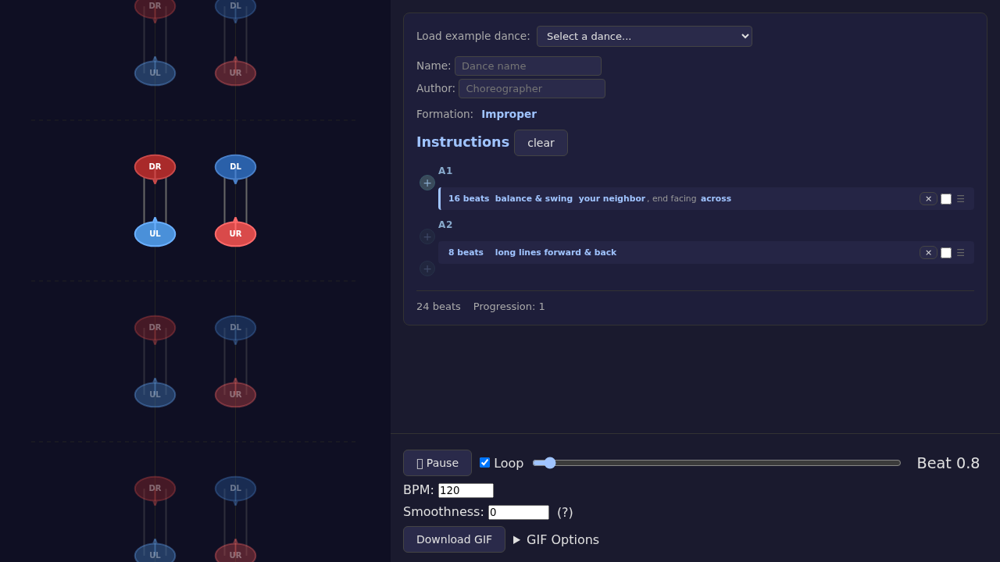
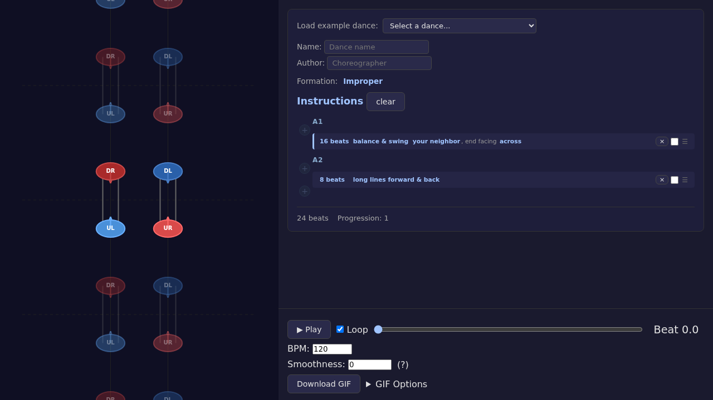

# Getting Started with Contravis

*2026-03-16T09:14:43Z by Showboat 0.6.1*
<!-- showboat-id: 7a73a9a1-a9b3-4f93-92f1-a6ca61a0af54 -->

This walkthrough demonstrates creating a simple contra dance from scratch in Contravis, then sharing it via URL.

## Step 1: Open the app

Contravis opens with a pre-loaded example dance (Otter's Allemande) to show what a finished dance looks like.

```bash
uvx rodney open http://localhost:5199/
```

```output
contravis4
```

```bash {image}
\
```



## Step 2: Clear the pre-loaded dance

Click "clear" to start with a blank slate.

```bash
uvx rodney js "document.querySelector(\"h2 button\").click()"
```

```output
null
```

```bash {image}
\
```



## Step 3: Click + to add an instruction

Click the "+" button to open the instruction text input.

```bash
uvx rodney click ".add-gap-btn"
```

```output
Clicked
```

```bash {image}
\
```



## Step 4: Type "neighbors balance and swing"

Type the instruction in natural language and press Enter. Contravis parses it and adds the instruction to your dance.

```bash
uvx rodney input ".add-instruction-text-input" "neighbors balance and swing"
```

```output
Typed: neighbors balance and swing
```

```bash
uvx rodney js "document.querySelector(\".add-instruction-text-input\").dispatchEvent(new KeyboardEvent(\"keydown\", {key: \"Enter\", code: \"Enter\", bubbles: true}))"
```

```output
true
```

```bash
uvx rodney text ".instruction-item"
```

```output
16 beats
balance & swing your neighbor, end facing across
×
☰
```

```bash {image}
\
```



## Step 5: Add "long lines forward and back"

Click the bottom "+" button and type another instruction. Contravis offers autocomplete suggestions as you type.

```bash
uvx rodney js "document.querySelectorAll(\".add-gap-btn\")[1].click()"
```

```output
null
```

```bash
uvx rodney input ".add-instruction-text-input" "long lines forward and back"
```

```output
Typed: long lines forward and back
```

```bash
uvx rodney js "document.querySelector(\".add-instruction-text-input\").dispatchEvent(new KeyboardEvent(\"keydown\", {key: \"Enter\", code: \"Enter\", bubbles: true}))"
```

```output
true
```

```bash
uvx rodney text ".instruction-list"
```

```output
A1
+
16 beats
balance & swing your neighbor, end facing across
×
☰
A2
+
8 beats
long lines forward & back
×
☰
+
```

```bash {image}
\
```



## Step 6: Share via URL

The dance state is encoded in the URL fragment. Copy the URL, close the window, open a new one, and navigate to the copied URL to verify the dance persists.

```bash
uvx rodney url | tee /tmp/shared-url.txt
```

```output
http://localhost:5199/#H4sIAAAAAAAAAz2NQQrDMAwE_6JzLr2U4gfkE6UY2VZdUUc2skMIIX-v09KcJHZ22A1qwzZXMFCUEk8sqCsMwMJtzDph4yyd8lQ0F9Ivqk1nf4Du3TdwhK1_l-sAbS3U2w4TiieLEmxdWGLXPAcw27-R0FHq6e8aEOL4cllhH4AkjOgPywB6zbX29Jy5nSspS7SJhap9Zl1Qg3Xo37A_9g_KyoJu2AAAAA
```

```bash
uvx rodney stop && uvx rodney start && uvx rodney open "$(cat /tmp/shared-url.txt)"
```

```output
Chrome stopped
Chrome started (PID 6386)
Debug URL: ws://127.0.0.1:36127/devtools/browser/22df6727-5212-4b6e-9af0-c4c10b7b0552
contravis4
```

```bash
uvx rodney text ".instruction-list"
```

```output
A1
+
16 beats
balance & swing your neighbor, end facing across
×
☰
A2
+
8 beats
long lines forward & back
×
☰
+
```

```bash {image}
\
```


